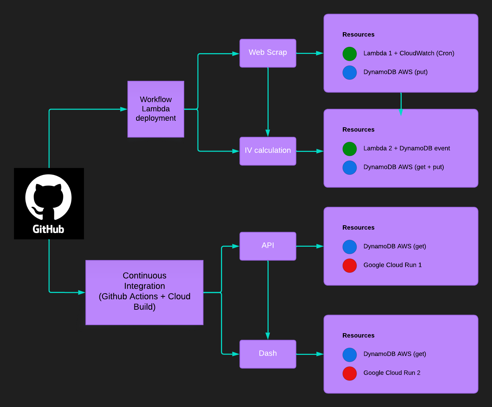
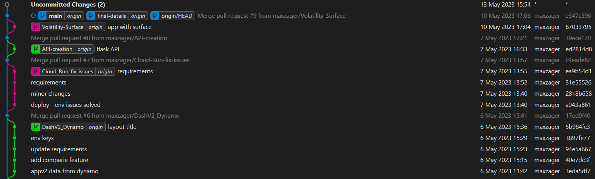
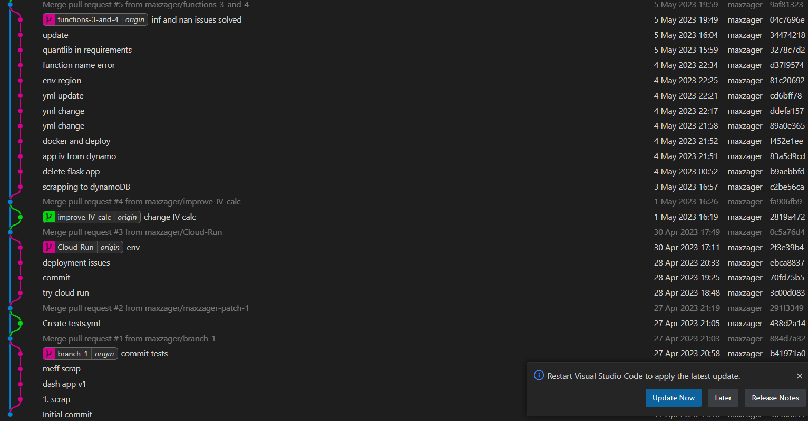

##  Examen Modulo Cloud
##  Zambelli Greminger Maximiliano
##  MIAX 10

### Link a la API y su documentación:
https://cloud-exam-api-rn47ughqvq-ew.a.run.app/

##### Uso de los endpoints:
	https://cloud-exam-api-rn47ughqvq-ew.a.run.app/ping
	https://cloud-exam-api-rn47ughqvq-ew.a.run.app/get_partitions
	https://cloud-exam-api-rn47ughqvq-ew.a.run.app/get_item?date=2023-05-10

### Link al Implied Volatility Dashboard
https://cloud-exam-main-rn47ughqvq-ew.a.run.app/

### Diagrama de la arquitectura

### Gitgraph:

